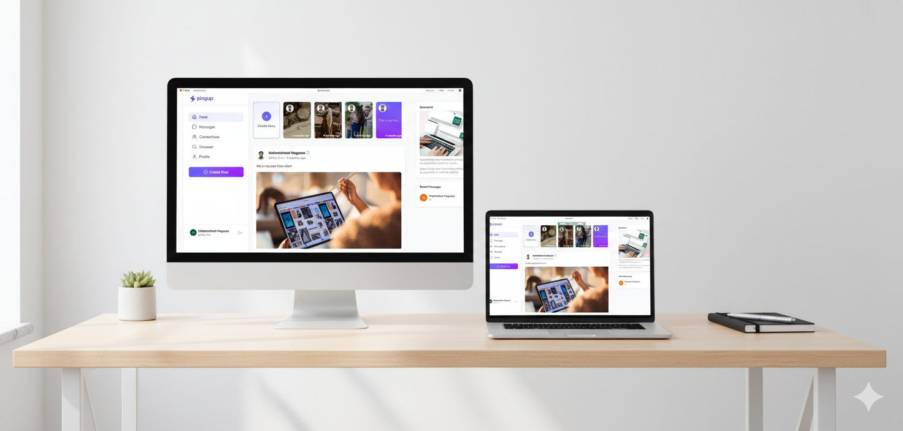

---


<h1 align="center">⚡ PingUp – Connect. Share. Discover.</h1>
<p align="center">A modern social platform crafted for global connection and seamless interaction.</p>


[](https://opensource.org/licenses/MIT)
[](https://reactjs.org/)
[](https://nodejs.org/)
[](https://www.mongodb.com/)
[](https://tailwindcss.com/)
[](https://ping-up-three.vercel.app/)


---

## 🧠 What is PingUp?

<h5>PingUp is a modern social networking platform designed to help users connect, share, and discover within a global community.
With a clean UI, seamless interactions, and powerful features, PingUp brings a fresh, elegant social experience.</h5>

---

## 🌟 Core Features  

### 🟣 Create & View Stories  
Beautiful horizontal story slider UI like modern social apps.

### 🔵 Post Feed  
Elegant feed layout with posts, images, timestamps, and user profiles.

### 🟢 Messaging Interface  
Recent messages, chat previews, and more.

### 🟠 Discover People  
Find new connections and communities.

### 🟡 Authentication  
Simple and secure login with Clerk (Email, Google, GitHub).

---

<div align="center">
 
</div>

---


## ⚡ Installation


1. Clone the Repository
 ```
git clone https://github.com/hilla10/ping-up.git
cd ChatApp
```
3. server Setup
```
cd server
npm install
npm run dev
```

Create a .env file in server/ with:
```
PORT = 3000

# Frontend URL

FRONTEND_URL=http://localhost:5173

# mongodb
MONGODB_URI=your_mongodb_uri

# inngest
INNGEST_EVENT_KEY=your_inngest_event_key
INNGEST_SIGNING_KEY=your_inngest_signing_key

# clerk
CLERK_PUBLISHABLE_KEY=your_clerk_publishable_key
CLERK_SECRET_KEY=your_clerk_secret_key

# imagekit
IMAGEKIT_URL=your_imagekit_url
IMAGEKIT_PUBLIC_KEY=your_imagekit_public_key
IMAGEKIT_PRIVATE_KEY=your_imagekit_private_key

# SMTP
SENDER_EMAIL=your_email || sender_email_address
SMTP_USER=your_smtp_user
SMTP_PASS=your_smtp_password
```
3. client Setup
```
cd ../client
npm install
npm run dev

```
Create a .env file in client/ with:
```
VITE_CLERK_PUBLISHABLE_KEY=your_clerk_publishable_key
VITE_BASEURL = http://localhost:3000
```


## 📁 Folder Structure
```bash
ChatApp/
 ├── client/
 │   └── src/
 │       ├── components/
 │       ├── pages/
 │       ├── api/
 │       └── app/
 │       └── features/
 │       └── assets/
 └── server/
     ├── controllers/
     ├── models/
     ├── routes/
     ├── middleware/
     └── config/
     └── inngest/
```


## 🤝 Contributing
1, Fork this repo

2, Create your feature branch

3, Commit changes

4, Open a Pull Request

## 📄 License

Licensed under the MIT License.

📬 Contact

Author: Hailemichael

🌐 Portfolio: [ portfolio](https://portfolio-rho-gules-15.vercel.app/)

💼 LinkedIn: [Linkedin](https://www.linkedin.com/in/hailemichaelnegusse/)


